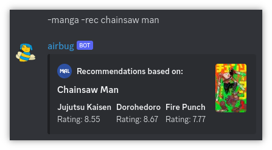

# AirBug v1


This was a very early attempt at a bot for Discord using Discord4J.\
The project has since been migrated to a JavaScript/Node.js/Discord.js base, which is currently being kept in a (as of 
writing this) private repository. I can't guarantee this version still
works because of the numerous updates Discord has been through since this was last worked on.

# Features

## AI responses
<p align="center">
    
</p>
<a href="https://openai.com/">
    <p align="center">
        
    </p>
</a>
Built with OpenAI's GPT3 model (pre-ChatGPT) using the "ada" base. "Ada" was great, as it was quick and cheap, but not
nearly as coherent as the "Davinci" base would have been, which was much more costly and slow. As a consequence, these 
responses were far below the mark we expect from ChatGPT today.

## Web Search

Airbug can search the web, given a query. This was implemented using Bing's web search API. This command also has a ton 
of aliases, so you can really use any search engine name as a command if you so please.
```
-bing [query]
```
<p align="center">
    
</p>

## Wikipedia Search

Airbug can grab a Wikipedia page, given a query.
```
-wiki [query]
```
<p align="center">
    
</p>

## MyAnimeList Integration

AirBug is able to search and provide information on any manga or anime on 
<a href="https://myanimelist.net/"></a>, as well as
offer recommendations based on a given title.

<h3 align="center">Anime/Manga Search</h3>
```
-anime [query]
-manga [query]
```
<p align="center">
    
</p>

<h3 align="center">Anime/Manga Recommendations</h3>
```
-anime -rec [query]
-manga -rec [query]
```
<p align="center">
    
</p>

## Other Commands

```
help                            ⟶  List of commands.
ping                            ⟶  Pong!
img [query]                     ⟶  Image search.
gif [query]                     ⟶  Gif search.
cowsay [text]                   ⟶  Prints an image of a cow saying your text.
cowthink [text]                 ⟶  Same as cowsay, but the cow keeps it to themselves.
figlet [text]                   ⟶  Prints the text in large ASCII-art letters.
choose [thing1, thing2, etc.]   ⟶  Chooses a random thing.
8ball [question]                ⟶  Ask it your deepest desires.
youtube [query]                 ⟶  Searches YouTube.
```